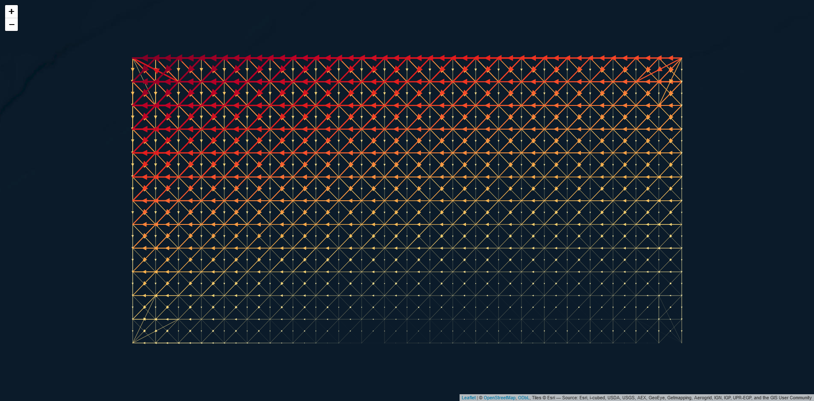
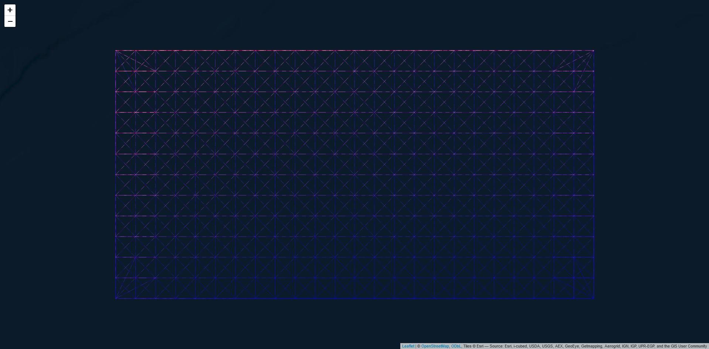

<!-- badges: start -->
[](https://CRAN.R-project.org/package=SeaGraphs)
[](https://github.com/cadam00/SeaGraphs)
[](https://github.com/cadam00/SeaGraphs/actions/workflows/R-CMD-check.yaml)
[](https://app.codecov.io/gh/cadam00/SeaGraphs)
[](https://doi.org/10.5281/zenodo.14169972)
<!-- badges: end -->

**This research was conducted at the Department of Marine Sciences, University
of the Aegean, Greece, supported by the European Union’s Horizon 2020 research
and innovation programme HORIZON-CL6–2021-BIODIV-01–12, under grant agreement
No 101059407, “MarinePlan – Improved transdisciplinary science for effective
ecosystem-based maritime spatial planning and conservation in European Seas”.**

## **Introduction to the SeaGraphs Package (tutorial)**

A plethora of sea current databases is typically available along many fields
data (e.g. Lima et al. ([2020](#ref-lima2020copernicus))). However,
transforming these data into a graph structure is not a straightforward
implementation. This gap is attempted to be filled by *SeaGraphs* package. A
further inspection of the methods used in this package is illustrated at
Nagkoulis et al. ([2025](#ref-nagkoulis2025ecological)), where the whole Black
Sea is examined.

## **Installation**

Latest official version of the package can be installed using:
``` r
install.packages("SeaGraphs")
```

Development version of the package can be installed using:
``` r
if (!require(remotes)) install.packages("remotes")
remotes::install_github("cadam00/SeaGraphs")
```

## **Citation**

> Nagkoulis N, Adam C, Mamoutos I, Mazaris AD, Katsanevakis S, 2025. An 
ecological connectivity dataset for Black Sea obtained from sea currents. Data
in Brief <b>58</b>: 111268. https://doi.org/10.1016/j.dib.2024.111268

## **Illustration example**

Currents information about the flow directions is usually split into horizontal
($u$) and vertical ($v$) components, regarding the horizontal and the vertical
flow of the currents, respectively. As an example we use a modified yearly
aggregated subset of the Black Sea site (Lima et al.,
[2020](#ref-lima2020copernicus); Schulzweida, [2023](#ref-schulzweida2020cdo))
provided in the form of `SpatRaster` elements. This input can be plotted using
the following:

``` r
# Import packages
library(SeaGraphs)
library(terra)

# Get example u and v components
component_u <- get_component_u()
component_v <- get_component_v()

# Plot each component
par(mfrow=c(1,2), las=1)
plot(component_u, main="u")
plot(component_v, main="v")
```

<p align="center">
  
</p>
<p class="caption" align="center">
<span id="fig-Figure1"></span>Figure 1: Currents $u$ and $v$ components.
</p>

In Figure [1](#fig-Figure1) the two directions of components $u$ and $v$ are
presented,  with higher currents values detected at the South-West direction.
A directed spatial graph in multiple forms (spatial network, shapefile, edge
list, adjacency matrix) based on these components is constructed, based on
these two components using the following process. This is doable by running the
`seagraph` command as follows:

``` r
# Transform currents information to graph
graph_result <- seagraph(component_u = component_u,
                         component_v = component_v)
```

Flow and antpath leaflet maps are two possible graphical representations of such
graphs using the `SeaGraphs` could be performed, but using `graph_result`
elements, like the shapefile one is possible as well. Note that the
South-Western directions of flows and magnitudes  the final graphs are depicted
in both Figures [2](#fig-Figure2) and [3](#fig-Figure3). Note that these outputs
are dependent on the selected number of nearest neighbors in the `seagraph`
function.

```r
flows_sfn(graph_result)
```

<p align="center">
  
</p>
<p class="caption" align="center">
<span id="fig-Figure2"></span>Figure 2: Flow leaflet map.
</p>


```r
antpath_sfn(graph_result)
```

<p align="center">
  
</p>
<p class="caption" align="center">
<span id="fig-Figure3"></span>Figure 3: Antpath leaflet map.
</p>

## **References**

<span class="nocase" id = "ref-lima2020copernicus"></span>
Lima, L., Aydogdu, A., Escudier, R., Masina, S., Ciliberti, S. A., Azevedo, D.,
Peneva, E. L., Causio, S., Cipollone, A., Clementi, E., Cretí, S., Stefanizzi,
L., Lecci, R., Palermo, F., Coppini, G., Pinardi, N., and Palazov, A. (2020).
Black Sea Physical Reanalysis (CMEMS BS-Currents) (Version 1) [Data set].
Copernicus Monitoring Environment Marine Service (CMEMS).
https://doi.org/10.25423/CMCC/BLKSEA_MULTIYEAR_PHY_007_004.
Last Access: 07/11/2024.

<span class="nocase" id = "ref-nagkoulis2025ecological"></span>
Nagkoulis, N., Adam, C., Mamoutos, I., Katsanevakis, S., and Mazaris, A. D.
(2025). An ecological connectivity dataset for Black Sea obtained from sea
currents. <em>Data in Brief</em>, <em>58</em>, 111268.
https://doi.org/10.1016/j.dib.2024.111268

<span class="nocase" id = "ref-schulzweida2020cdo"></span>
Schulzweida, U. (2023). CDO User Guide (23.0). Zenodo.
https://doi.org/10.5281/zenodo.10020800
